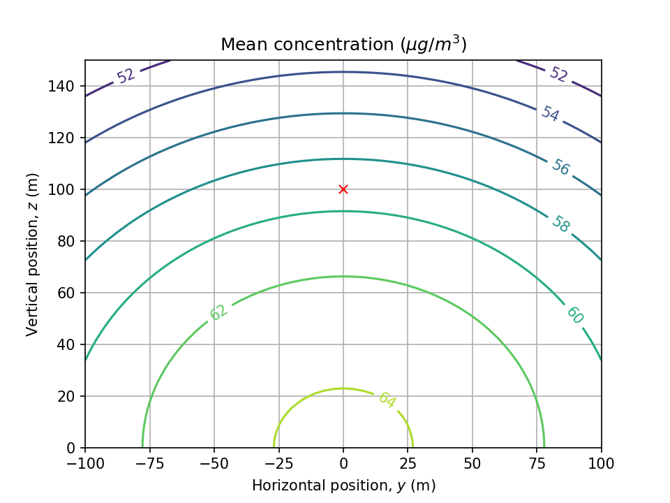

# air-disp-gpm
Demonstration of how to calculate the concentrations of a pollutant downwind of a point source using the Gaussian plume model of [air dispersion](https://en.wikipedia.org/wiki/Atmospheric_dispersion_modeling).

Based on the excellent video lecture by Prof. Bhola Ram Gurjar, Indian Institute of Technology, Roorkee, published online here:
 - https://www.youtube.com/watch?v=wsriuZzKJ1c
